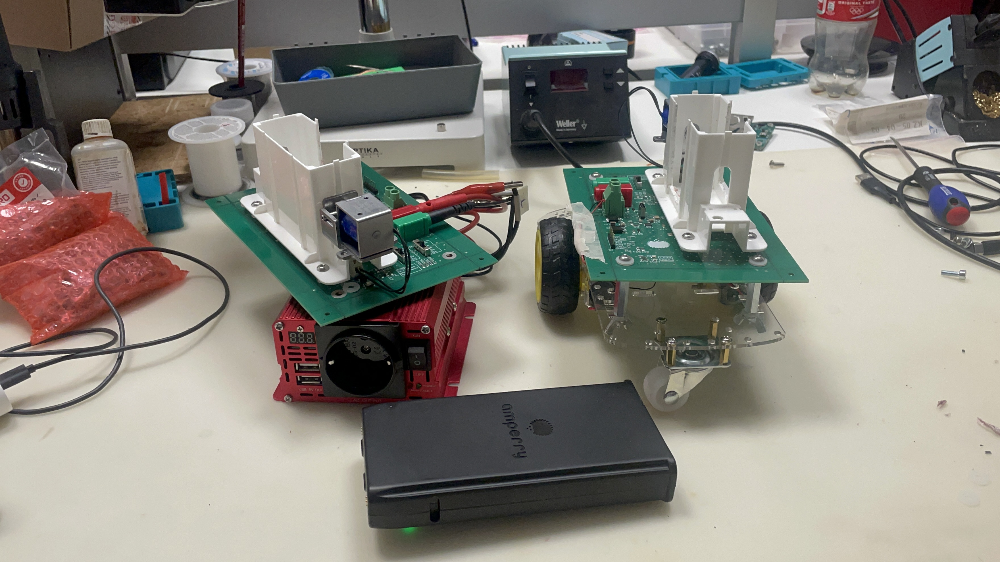

# ⚡ Open Robot Battery (ORB)

 

*An open-source power delivery module for makers and robotics, powered by Amperry powerbanks.*

  
*Humanoid robot powered by the ORB module.*

  
*Four-wheeled warehouse robot with ORB battery module.*

  
*Front PCB view.*

  
*Back PCB view.*

  
*ORB inverter-turtle prototype with power inverter integration.*

  
*ORB development kit prototype for mobile robot applications.*

---

## 📖 Introduction

The **Open Robot Battery** (codename **ORB**) is an open-source hardware module designed to power up robots, IoT devices, drones, and prototypes.  

It works with **Amperry powerbanks**, which are charged inside Amperry stations, and provides makers, startups, and research labs with a flexible, safe, and modular way to bring portable energy into their projects.  

> ⚠️ **Important**: To use ORB you need an **Amperry-compatible powerbank**, which must be purchased together with an Amperry station. The ORB module is open-source, but the powerbanks remain proprietary.

---

## 🚀 Features

- ✅ Open hardware design for makers, startups, and research labs  
- ✅ Modular connection system (pogo pins, solenoid lock)  
- ✅ Flexible output: USB-C PD, robotics connectors (XT30/XT60), barrel jacks, etc.  
- ✅ Adaptable form factor – attach to robots, kiosks, IoT devices  
- ✅ Safe and tested with Amperry powerbanks  

---

## 🔌 How It Works
[ Amperry Station ] → [ Powerbank ] → [ ORB Module ] → [ Your Device ]

1. Powerbanks are charged inside the **Amperry station**.  
2. The charged powerbank is docked into the **ORB module**.  
3. ORB adapts the energy and delivers it to your device via your preferred connector.  

---

## 📦 Hardware Requirements

- **Required**: Amperry powerbank (purchase with a station from [Amperry](https://amperry.me))  
- Supported power levels:  
  - 5V (USB devices, IoT sensors)  
  - 12V (embedded boards, routers)  
  - 20V (robots, laptops, drones)  
- Connectors: USB-C PD, XT60, barrel jack, GPIO headers (customizable)  

---

## 🛠 Getting Started

1. Order an **Amperry powerbank + station**.  
2. Clone/download this repository.  
3. Access the **hardware files** in the `hardware/` folder:
   - Review the **schematics** (`hardware/schematics/LANDER_schematics.pdf`)
   - Check the **BOM** (`hardware/bom/LANDER_BOM.csv`) for component sourcing
   - Download **gerber files** (`hardware/gerber/LANDER-gerber-files.zip`) for PCB manufacturing
   - Use **CAD files** (`hardware/cad/LANDER_project_311025.zip`) for mechanical design and KiCad source files
4. Build or 3D-print the ORB module.  
5. Add the connectors your project requires.  
6. Plug in your powerbank and start powering your device.

## 🔧 Using with KiCad

The ORB project includes complete KiCad source files for both schematics and PCB layout. Follow these steps to open and work with the project in KiCad:

### Opening the KiCad Project

1. **Extract the CAD files**:
   ```bash
   cd hardware/cad
   unzip LANDER_project_311025.zip
   ```

2. **Open in KiCad**:
   - Launch KiCad (version 8.0 or later recommended)
   - Go to **File → Open Project**
   - Navigate to the extracted folder and open `Amperry_robot.kicad_pro`

3. **Project Structure**:
   The KiCad project contains:
   - `Amperry_robot.kicad_sch` - Main schematic file
   - `inputs_sheet.kicad_sch` - Input section schematic
   - `mech_conn_sheet.kicad_sch` - Mechanical connector section schematic
   - `Amperry_robot.kicad_pcb` - PCB layout file

### Viewing Schematics

- Click **Open Schematic** (or press `Ctrl+E`) to view the electrical schematics
- The project uses hierarchical sheets - navigate between sheets using the **Hierarchy Navigator** (press `Ctrl+H`)
- Use the **Properties** panel (press `E` on a component) to view component details

### Viewing PCB Layout

- Click **Open PCB Editor** (or press `Ctrl+P`) to view the PCB layout
- Use **3D Viewer** (press `Alt+3`) to see a 3D visualization of the board
- Switch between front and back layers using the layer selector

### Making Modifications

1. **Before making changes**, create a new branch or fork the repository
2. **Modify schematics** as needed:
   - Add/remove components
   - Adjust component values
   - Modify connections
3. **Update PCB layout** if schematic changes affect the board:
   - Run **Tools → Update PCB from Schematic** (or press `F8`) to sync changes
   - Adjust component placement and routing as needed
4. **Generate new Gerber files**:
   - Go to **File → Fabrication Outputs → Gerbers**
   - Select all layers and click **Generate Drill Files**
   - Export files for manufacturing

### Exporting for Manufacturing

1. **Generate Gerbers**:
   - File → Fabrication Outputs → Gerbers
   - Ensure all layers are selected (F.Cu, B.Cu, F.Silkscreen, B.Silkscreen, F.Mask, B.Mask, Edge.Cuts)
   - Generate drill files (PTH and NPTH)

2. **Generate BOM**:
   - File → Fabrication Outputs → BOM
   - Export as CSV or use the built-in BOM tool

3. **Create 3D Model**:
   - File → Export → STEP
   - Useful for mechanical integration

### Tips for Contributors

- Always run **Electrical Rules Check** (ERC) before committing changes (Tools → ERC)
- Run **Design Rules Check** (DRC) for PCB changes (Tools → DRC)
- Keep component libraries updated
- Document any significant changes in commit messages
- Test schematic changes by regenerating and reviewing the PDF export

## 📋 Documentation

- **[Technical Manual](MANUAL.md)** - Complete technical documentation including assembly instructions, safety warnings, and usage guidelines
- **[Hardware Files](hardware/)** - All hardware design files organized by type:
  - **[Schematics](hardware/schematics/)** - Electrical schematics in PDF format
  - **[Gerber Files](hardware/gerber/)** - PCB manufacturing files
  - **[Bill of Materials](hardware/bom/)** - Complete BOM in CSV format
  - **[CAD Files](hardware/cad/)** - KiCad source files (.kicad_sch, .kicad_pcb), 3D mechanical models (STEP), and Gerber files
  - **[Images](images/)** - Project images and diagrams  

---

## 💡 Example Use Cases

- 🤖 Robotics platforms and mobile robots  
- 🚁 Drones and UAVs  
- 🌐 IoT devices and field instruments  
- 🏫 University labs and prototyping kits  
- 🖥 Portable kiosks and installations  

---

## 📜 License & Usage Rules

- ORB is released as **open-source hardware** (license: [CC BY-NC-SA]).  
- **Restrictions**:  
  - The **Amperry powerbank hardware is proprietary** and must be purchased from Amperry.  
  - Usage in **powerbank rental systems** is exclusive to Amperry.  
  - Usage in **defense or weapons applications** requires prior approval and a special license.  

- For complete license details, see [LICENSE.md](LICENSE.md).
---

## 🤝 Contributing

We welcome contributions from the community! Here's how you can help improve the Open Robot Battery project.

### How to Contribute

1. **Report Issues**:
   - Found a bug or have a suggestion? Open an issue on GitHub
   - Include as much detail as possible: steps to reproduce, expected vs actual behavior, relevant files

2. **Improve Documentation**:
   - Fix typos or clarify instructions
   - Add missing information or examples
   - Translate documentation to other languages
   - Improve code comments and docstrings

3. **Hardware Improvements**:
   - **KiCad Project**: Modify schematics or PCB layout using the provided KiCad files
     - Extract the CAD files from `hardware/cad/LANDER_project_REV_DATE.zip` to work on them
     - Make changes in a new branch
     - Run ERC (Electrical Rules Check) and DRC (Design Rules Check) before submitting
     - Export updated Gerber files and update the repository
     - **Before committing**: Re-zip the CAD project folder and delete the unzipped folder
       ```bash
       cd hardware/cad
       zip -r LANDER_project_REV_DATE.zip [extracted_folder_name]/
       rm -rf [extracted_folder_name]/
       ```
     - Only commit the `.zip` file, not the extracted project files
     - This keeps the repository clean and prevents versioning conflicts with KiCad temporary files
   - **Mechanical Design**: Improve casing, mounting options, or add new connector configurations
   - **Component Selection**: Suggest better components or alternatives in the BOM

4. **Submit Pull Requests**:
   - Fork the repository
   - Create a feature branch (`git checkout -b feature/amazing-feature`)
   - Make your changes and test thoroughly
   - Commit with clear messages (`git commit -m 'Add amazing feature'`)
   - Push to your fork (`git push origin feature/amazing-feature`)
   - Open a Pull Request with a clear description of changes

### Contribution Guidelines

- **Code/Hardware Changes**:
  - Follow existing project structure and naming conventions
  - Ensure all tests pass (if applicable)
  - Update documentation for any new features
  - Run ERC/DRC checks for KiCad changes

- **Documentation**:
  - Use clear, concise language
  - Include examples where helpful
  - Update the README if adding new features

- **Pull Request Process**:
  - Keep PRs focused on a single feature or fix
  - Reference related issues in your PR description
  - Be responsive to feedback and requested changes

### Areas Where We Need Help

- 🐛 **Bug Fixes**: Test the design and report any issues
- 🔌 **New Connectors**: Add support for additional connector types
- 📐 **Mechanical Designs**: Improve casing, mounting solutions, or create 3D printable parts
- 🌍 **Translations**: Translate documentation to other languages
- 📚 **Examples**: Create example projects and use cases
- 🔬 **Testing**: Test designs with different powerbanks and report results

### Share Your Projects

We love seeing what people build with ORB! Share your projects:
- Open an issue with photos and description
- Tag us on social media
- Contribute to the gallery section

Thank you for contributing to open-source hardware! 🎉  

---

## 🌍 Community & Contact

- 🌐 Website: [https://tomorrowtech.it/open-robot-battery.html](https://amperry.me)  
- ✉️ Email: sviluppo@tomorrowtech.it  

---
