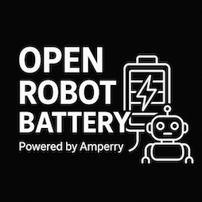

# ⚡ Open Robot Battery (ORB)

 

*An open-source power delivery module for makers and robotics, powered by Amperry powerbanks.*

  
*Humanoid robot powered by the ORB module.*

  
*Four-wheeled warehouse robot with ORB battery module.*

---

## 📖 Introduction

The **Open Robot Battery** (codename **ORB**) is an open-source hardware module designed to power up robots, IoT devices, drones, and prototypes.  

It works with **Amperry powerbanks**, which are charged inside Amperry stations, and provides makers, startups, and research labs with a flexible, safe, and modular way to bring portable energy into their projects.  

> ⚠️ **Important**: To use ORB you need an **Amperry-compatible powerbank**, which must be purchased together with an Amperry station. The ORB module is open-source, but the powerbanks remain proprietary.

---

## 🚀 Features

- ✅ Open hardware design for makers, startups, and research labs  
- ✅ Modular connection system (pogo pins, solenoid lock)  
- ✅ Flexible output: USB-C PD, robotics connectors (XT30/XT60), barrel jacks, etc.  
- ✅ Adaptable form factor – attach to robots, kiosks, IoT devices  
- ✅ Safe and tested with Amperry powerbanks  

---

## 🔌 How It Works
[ Amperry Station ] → [ Powerbank ] → [ ORB Module ] → [ Your Device ]

1. Powerbanks are charged inside the **Amperry station**.  
2. The charged powerbank is docked into the **ORB module**.  
3. ORB adapts the energy and delivers it to your device via your preferred connector.  

---

## 📦 Hardware Requirements

- **Required**: Amperry powerbank (purchase with a station from [Amperry](https://amperry.me))  
- Supported power levels:  
  - 5V (USB devices, IoT sensors)  
  - 12V (embedded boards, routers)  
  - 20V (robots, laptops, drones)  
- Connectors: USB-C PD, XT60, barrel jack, GPIO headers (customizable)  

---

## 🛠 Getting Started

1. Order an **Amperry powerbank + station**.  
2. Clone/download this repository.  
3. Access the **hardware files** in the `hardware/` folder:
   - Review the **schematics** (`hardware/schematics/ORB-schematics.pdf`)
   - Check the **BOM** (`hardware/bom/ORB-BOM.xlsx`) for component sourcing
   - Download **gerber files** (`hardware/gerber/ORB-gerber-files.zip`) for PCB manufacturing
   - Use **CAD files** (`hardware/cad/ORB-CAD-files.zip`) for mechanical design
4. Build or 3D-print the ORB module.  
5. Add the connectors your project requires.  
6. Plug in your powerbank and start powering your device.

## 📋 Documentation

- **[Technical Manual](MANUAL.md)** - Complete technical documentation including assembly instructions, safety warnings, and usage guidelines
- **[Hardware Files](hardware/)** - All hardware design files organized by type:
  - **[Schematics](hardware/schematics/)** - Electrical schematics in PDF format
  - **[Gerber Files](hardware/gerber/)** - PCB manufacturing files
  - **[Bill of Materials](hardware/bom/)** - Complete BOM in Excel format
  - **[CAD Files](hardware/cad/)** - 3D mechanical models and STL files
  - **[Images](hardware/images/)** - Project images and diagrams  
- **[ROS 2 Workspace](ros2/README.md)** - Software support packages, including the I2C manager, simulation backend, and the Infineon EZ-PD BCR driver  

## 🧪 Raspberry Pi I2C Bring-up

To exercise the EZ-PD BCR interface with a Raspberry Pi:
- Enable I²C with `sudo raspi-config` → Interfaces → I2C → Enable, then reboot.
- Wire the board to the Pi header (3.3 V logic only):
  - Board SDA → Pi GPIO2 (pin 3)
  - Board SCL → Pi GPIO3 (pin 5)
  - Board GND → Pi GND (pin 9)
  - Optionally tie board 3.3 V reference to Pi 3V3 (pin 1) if required by your design.
- Install the Python dependency: `pip install smbus2`.
- Copy and run the helper script: `python3 ros2/scripts/raspi_ez_pd_demo.py`.

The script polls Status Register 1 once per second and prints the bitmask (datasheet section 6.3), letting you verify electrical connectivity before deploying the ROS 2 node.

---

## 💡 Example Use Cases

- 🤖 Robotics platforms and mobile robots  
- 🚁 Drones and UAVs  
- 🌐 IoT devices and field instruments  
- 🏫 University labs and prototyping kits  
- 🖥 Portable kiosks and installations  

---

## 📜 License & Usage Rules

- ORB is released as **open-source hardware** (license: [CC BY-NC-SA]).  
- **Restrictions**:  
  - The **Amperry powerbank hardware is proprietary** and must be purchased from Amperry.  
  - Usage in **powerbank rental systems** is exclusive to Amperry.  
  - Usage in **defense or weapons applications** requires prior approval and a special license.  

---

## 🤝 Contributing

We welcome contributions!  
- Submit issues for bugs, ideas, or feature requests.  
- Open pull requests with improvements (new connector types, casing designs, documentation).  
- Share your projects built with ORB in the community.  

---

## 🌍 Community & Contact

- 🌐 Website: [https://amperry.me](https://amperry.me)  
- ✉️ Email: sviluppo@tomorrowtech.it  

---

## 📷 Gallery

  
*Example setup of Amperry station, powerbank, and ORB powering a robot.*  

---
